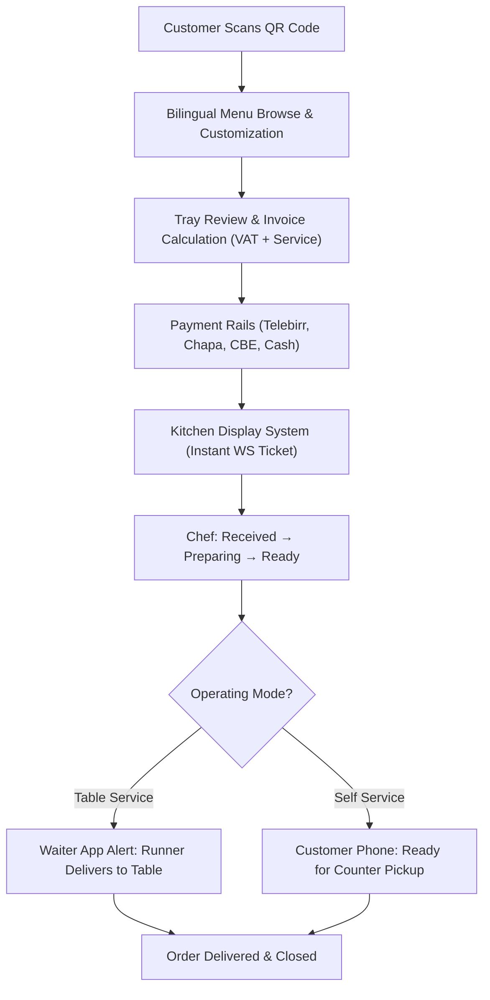

# MenuFlow — Master Implementation & Architecture Plan (Single Customizable App)

**Model:** Standalone, Easily Customizable Restaurant Application (Not Multi-Tenant SaaS)  
**Target Market:** Ethiopian Restaurants, Cafes & Lounges  
**Date:** October 2026  

---

## 1. Architectural Strategy

We transitioned the platform from a multi-tenant SaaS architecture to **ONE clean, highly-customizable deployable application**:
- **Why this model?** Most Ethiopian hospitality businesses require custom brand identity, distinct localized payment accounts, separate operational flows (fast-casual counter pickup vs. fine dining waiter running), and data privacy without shared tenant database risks.
- **Customization Engine:** Instead of custom coding per client, the entire platform is parameterized through `restaurant.config.json` (business rules, mode, tax, payment keys) and `theme.json` (design tokens, colors, typography).

---

## 2. Multi-Device UI Architecture

```
┌────────────────────────────────────────────────────────────────────────┐
│                        MenuFlow UI Design Suite                        │
├────────────────────────────────┬───────────────────────────────────────┤
│ Surface                        │ Form Factor & UX Behavior             │
├────────────────────────────────┼───────────────────────────────────────┤
│ Customer Mobile Web App (PWA)  │ Smartphone Portrait (Thumb Zone)      │
│                                │ • Warm cream (#FDFBF7) linen backdrop │
│                                │ • High-res Ethiopian dish photography │
│                                │ • Bilingual toggle (English / አማርኛ)  │
│                                │ • Bottom customization drawer         │
│                                │ • Telebirr / Chapa / CBE / Cash pay   │
├────────────────────────────────┼───────────────────────────────────────┤
│ Kitchen Display System (KDS)   │ Tablet / Wall Monitor (Landscape)     │
│                                │ • Native high-contrast Dark Mode      │
│                                │ • Live WebSocket ticket sync          │
│                                │ • Age-based color alerts (<8m, >15m)  │
│                                │ • 1-tap state advancement             │
├────────────────────────────────┼───────────────────────────────────────┤
│ Waiter Runner Mobile App       │ Handheld Smartphone                   │
│                                │ • High-priority "Ready" order queue   │
│                                │ • Large table number badges           │
│                                │ • 1-tap "Mark Delivered" action       │
│                                │ • Instant table assistance alerts     │
├────────────────────────────────┼───────────────────────────────────────┤
│ Admin & Cashier Dashboard      │ Desktop / Laptop (Split-View)         │
│                                │ • Weekly sales analytics in ETB       │
│                                │ • Live table occupancy grid           │
│                                │ • Menu stock & price toggles          │
│                                │ • 1-click printable QR token sheet    │
│                                │ • Cash bill settlement register       │
└────────────────────────────────┴───────────────────────────────────────┘
```

---

## 3. Order Lifecycle Flow



---

## 4. Next Deployment Steps

1. Configure `restaurant.config.json` with the client restaurant's name, logo, tax rules, and Telebirr/Chapa credentials.
2. Adjust `theme.json` with client brand colors.
3. Run `docker compose up -d` to launch PostgreSQL and Redis.
4. Launch the Go API backend (`go run ./cmd/server/main.go`) and Next.js frontend (`npm run build && npm start`).
