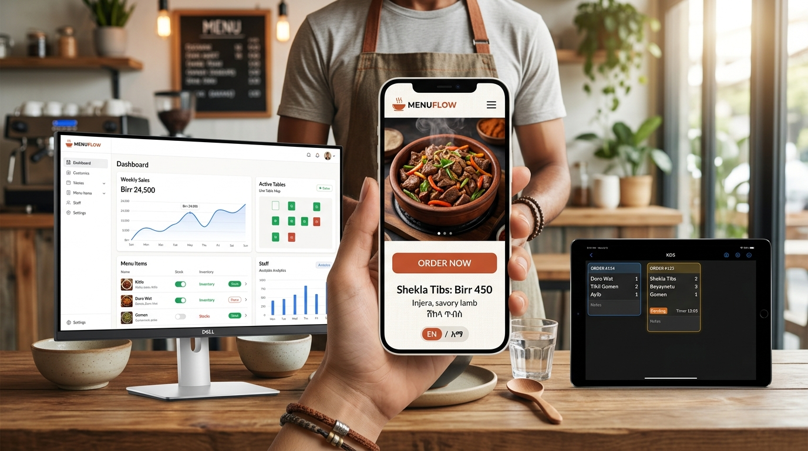
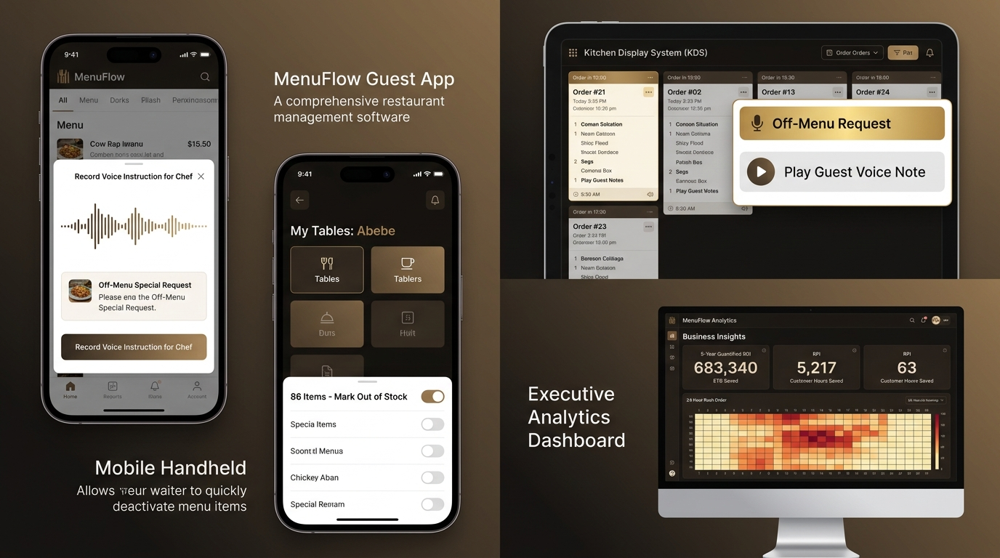
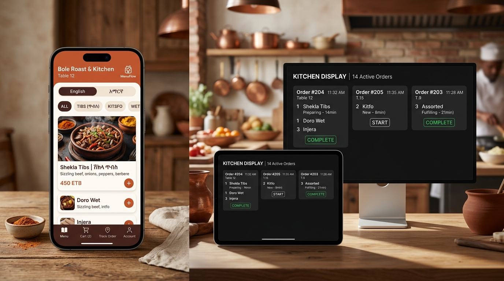

# MenuFlow (ሜኑ ፍሎው) — Comprehensive Testing & Feature Guide

> **How to run, test, and experience all MenuFlow features across Customer PWA, Kitchen Display System (KDS), Waiter Handheld, and Backoffice Command Center.**

---

## 📸 MenuFlow UI Operations Suite Showcase


*Figure 1: Complete MenuFlow Operations Suite — Customer Mobile PWA (Table 04), Chef KDS Landscape Display, Waiter Handheld Runner, and Desktop Manager Command Center.*


*Figure 2: Advanced Features Suite — Spoken Voice Notes & Off-Menu Requests (PWA), Floor Zones & Mobile 86'ing Stock Tool (Waiter Handheld), Kitchen Audio Player (KDS), and 5-Year Quantified ROI Analytics & Rush Heatmap (Admin).*

---

## 1. Quick Start: Running the Platform

To test real-time ordering and live WebSocket synchronization across devices on your local network (`10.10.4.109`), ensure both the Go backend and Next.js frontend are running.

### Terminal 1: Start the Go Backend (Port 8080)
```bash
cd backend
go run ./cmd/server/main.go
```
*Runs on `http://0.0.0.0:8080` with the native RFC 6455 WebSocket Hub, Order Engine, KDS pipelines, and Service Request dispatchers.*

### Terminal 2: Start the Next.js Frontend (Port 3000)
```bash
cd frontend
npm run dev
```
*Runs on `http://0.0.0.0:3000` accessible from your computer or any smartphone connected to the same Wi-Fi at `http://10.10.4.109:3000`.*

---

## 2. Directory of Surfaces & Direct URLs

| Surface Role | Localhost URL | Network URL (Mobile / Tablet) | Purpose & Key Features |
|---|---|---|---|
| **Customer Menu (Dine-in)** | [`http://localhost:3000/t/demo_token/menu`](http://localhost:3000/t/demo_token/menu) | `http://10.10.4.109:3000/t/demo_token/menu` | Browse food/drinks, bilingual EN/አማ toggle, dish customization drawer, **🛎️ Table Assistance Bell**, **🧾 View Digital Bill**, cart tray dock. |
| **Customer Menu (Takeaway)** | [`http://localhost:3000/p/demo_token/menu`](http://localhost:3000/p/demo_token/menu) | `http://10.10.4.109:3000/p/demo_token/menu` | Pickup #P04 takeaway ordering with packaging options. |
| **Tray Checkout** | [`http://localhost:3000/checkout`](http://localhost:3000/checkout) | `http://10.10.4.109:3000/checkout` | Itemized review, 10% Service + 15% VAT calculation, **Dine First (Add to Tab)** / Telebirr / Chapa / CBE / Cash, live backend dispatch. |
| **Live Order Progress Tracker** | [`http://localhost:3000/order/01J8ORD100`](http://localhost:3000/order/01J8ORD100) | `http://10.10.4.109:3000/order/01J8ORD100` | Real-time WebSocket 4-step status timeline, pickup alert, **🛎️ Call Waiter**, **💳 View Digital Bill & Settle**. |
| **Table Digital Bill & Settle** | [`http://localhost:3000/t/demo_token/bill`](http://localhost:3000/t/demo_token/bill) | `http://10.10.4.109:3000/t/demo_token/bill` | **Consolidated multi-round bill**, itemized rounds, 10% Service + 15% VAT, 1-tap Telebirr/Chapa/CBE settlement, **Ethiopian Fiscal Receipt generator**. |
| **Chef Kitchen Display (KDS)** | [`http://localhost:3000/kds`](http://localhost:3000/kds) | `http://10.10.4.109:3000/kds` | High-contrast dark mode, aging warning badges (<8m green, 8–15m amber, >15m red), **live incoming ticket chimes**, 1-tap **Bump** button. |
| **Waiter Runner Handheld** | [`http://localhost:3000/waiter`](http://localhost:3000/waiter) | `http://10.10.4.109:3000/waiter` | Priority "Ready" orders queue, **live table assistance alerts (Water, Waiter, Bill)**, **💰 Live Bill Settled Banners**, 1-tap **`[ MARK DELIVERED ✔ ]`**. |
| **Desktop Manager Command Center** | [`http://localhost:3000/admin`](http://localhost:3000/admin) | `http://10.10.4.109:3000/admin` | Persistent sidebar, weekly sales spline chart, live active floor map, 1-tap stock availability switches (86'ing). |
| **Cashier Till Register** | [`http://localhost:3000/admin/cashier`](http://localhost:3000/admin/cashier) | `http://10.10.4.109:3000/admin/cashier` | Live cash orders to collect, settled till history, 1-tap `[ ✓ Mark Cash Paid ]`. |
| **Sales Analytics & Orders** | [`http://localhost:3000/admin/orders`](http://localhost:3000/admin/orders) | `http://10.10.4.109:3000/admin/orders` | Gross sales in ETB, AOV, best-sellers ranking, and provider reconciliation (Telebirr vs Chapa vs CBE vs Cash). |
| **Tables & QR Generator** | [`http://localhost:3000/admin/tables`](http://localhost:3000/admin/tables) | `http://10.10.4.109:3000/admin/tables` | Table floor cards, HMAC token version bump, 1-click printable QR sheet modal. |
| **Establishment Settings** | [`http://localhost:3000/admin/settings`](http://localhost:3000/admin/settings) | `http://10.10.4.109:3000/admin/settings` | Operational modes (Table Service vs Counter Pickup), tax sliders, payment provider toggles. |

---

## 3. Step-by-Step Interactive Test Scenarios

### 🧪 Test Scenario 1: Table Assistance & Service Requests (Water, Waiter, Bill)
*Demonstrates customer-to-waiter direct communication without waving hands across a busy restaurant.*

1. **Open Customer Menu on Phone or Tab 1:**  
   Navigate to [`http://10.10.4.109:3000/t/demo_token/menu`](http://10.10.4.109:3000/t/demo_token/menu).
2. **Open Waiter Handheld on Tab 2 (or a second phone):**  
   Navigate to [`http://10.10.4.109:3000/waiter`](http://10.10.4.109:3000/waiter).
3. **Trigger Assistance from Customer Screen:**  
   - In Tab 1 (Customer Menu), look at the top header next to the cart icon `🛒`.  
   - Click the **`🛎️` Assistance Bell** button.  
   - An interactive modal slides up presenting 5 options:
     - 🛎️ **Call Waiter** (General table assistance)
     - 💧 **Water & Glasses** (Drinking water request)
     - 🍴 **Napkins & Cutlery** (Extra forks, napkins, toothpicks)
     - 🧾 **Request Bill** (Ready to pay at table)
     - ⚠️ **Report an Issue** (Delay, temperature, or dish error)
   - Select **"Water & Glasses"**, optionally type *"2 glasses of cold water"*, and tap **"🔔 Send Request to Waiter"**.
4. **Observe Waiter Handheld (Tab 2):**  
   - The waiter handheld plays an **audible double-chime** in real time!
   - A pulsing amber alert card appears at the top:  
     `TABLE 04 • WATER - "2 glasses of cold water"`.
   - Tap **`[ On My Way 🏃 ]`**: the card updates to in-progress status.
   - Tap **`[ Done ✓ ]`**: the request is resolved and dismissed from the waiter's queue.

---

### 🧪 Test Scenario 2: End-to-End Live Ordering & Kitchen Coordination (KDS $\rightarrow$ Waiter $\rightarrow$ Guest)
*Demonstrates live multi-device WebSocket synchronization without page refreshes.*

1. **Set Up Three Windows/Tabs Side-by-Side:**
   - **Window A:** [`http://10.10.4.109:3000/t/demo_token/menu`](http://10.10.4.109:3000/t/demo_token/menu) (Customer)
   - **Window B:** [`http://10.10.4.109:3000/kds`](http://10.10.4.109:3000/kds) (Chef KDS)
   - **Window C:** [`http://10.10.4.109:3000/waiter`](http://10.10.4.109:3000/waiter) (Waiter Runner)
2. **Customer Builds & Places an Order (Window A):**
   - Click on the **Food** card.
   - Click on **Classic Addis Cheeseburger**.
   - In the slide-up customization drawer, select **"No Onions"**, **"+ Extra Cheddar Cheese"**, and type special instruction: *"Medium well please"*.
   - Tap **"Add to Active Tray"**.
   - Tap the floating cart pill at the bottom or the top `🛒` icon $\rightarrow$ Click **"Proceed to Checkout"**.
   - On the Checkout page, select **"Telebirr"** or **"Cash at Counter"**.
   - Click **"Confirm & Pay ETB 638"**.
   - Notice: The order is sent via `POST /api/v1/orders/create` to the live Go backend!
   - Click **"Track Live Kitchen Progress →"** to enter `/order/[order_id]`.
3. **Observe Chef KDS (Window B):**
   - In real time, the KDS **chimes with a high-pitched ping**!
   - A brand new ticket card appears on the KDS board:  
     `ORDER #... • TABLE 04` listing the burger with *"NO ONIONS | + Extra Cheddar Cheese | Medium well please"*.
4. **Advance Cooking State (Window B):**
   - Chef taps **"Bump"** on the ticket card:
     - The status advances to **Cooking** (Timer starts ticking).
     - **Look at Window A (Customer):** The timeline automatically animates to **"Chef is Preparing Your Food (በማዘጋጀት ላይ)"** in real time!
5. **Mark Order Ready (Window B):**
   - Chef taps **"Bump"** again:
     - The order disappears from the kitchen cooking pass.
     - The backend broadcasts `order.ready` to floor staff and customer.
6. **Observe Waiter Handheld (Window C) & Customer (Window A):**
   - **Waiter Handheld (Window C):** Chimes with a triple ready alert! The burger appears in the **Kitchen Pass** priority delivery queue with table number badge `Table 04`.
   - **Customer Phone (Window A):** Chimes and pops up the **"Your Food is Ready!"** modal notification!
7. **Deliver the Food (Window C):**
   - Waiter runner walks to Table 04 and taps **`[ MARK DELIVERED ✔ ]`**.
   - **Look at Window A (Customer):** The tracker instantly updates to **"Order Delivered — መልካም ምግብ!"** with a green checkmark!


*Figure 2: Customer PWA Experience — Dish Customization, Itemized Invoice Checkout, and Live 4-Step Preparation Progress Tracker.*

---

### 🧪 Test Scenario 3: Bilingual Ethiopic (Ge'ez) & English Switching
1. Open [`http://10.10.4.109:3000/t/demo_token/menu`](http://10.10.4.109:3000/t/demo_token/menu).
2. Tap the floating capsule button in the header: **`[EN | አማ]`**.
3. Tap **`አማ`**:
   - Headers switch to Amharic: *"ምን ማዘዝ ይፈልጋሉ?"*.
   - Categories switch to: *"ምግቦች"* and *"መጠጦች"*.
   - Dish names and ingredients render in clean Ethiopic Ge'ez typography (*ሽክላ ጥብስ*, *የጀበና ቡና*, *የፍስክ በያይነቱ*).
4. Tap **`EN`** to switch back to Latin English typography instantly.

---

### 🧪 Test Scenario 4: Quick 86'ing (Menu Stock Availability)
*Demonstrates instant sold-out synchronization between manager and guests.*

1. Open Manager Dashboard: [`http://10.10.4.109:3000/admin`](http://10.10.4.109:3000/admin).
2. Look at **Card 3 — Menu Items Quick Stock Manager**:
   - Find **"Gomen Be Siga"** or **"Special Kitfo"**.
   - Tap the stock switch to toggle between **In Stock** (🟢) and **Out of Stock** (🔴).
3. On the guest menu, sold-out items are automatically greyed out with an "86'd / Sold Out" badge to prevent customer ordering errors.

---

### 🧪 Test Scenario 5: Cashier Register & Cash Settlement
1. Open Cashier Till: [`http://10.10.4.109:3000/admin/cashier`](http://10.10.4.109:3000/admin/cashier).
2. Review the **Till Balance KPI Cards**:
   - *Pending Cash to Collect* (Orders placed with cash payment).
   - *Settled Till Total* (Verified cash collected today).
3. View the **Live Orders Table**:
   - Look at unpaid cash orders (e.g. Table 04, Table 02).
   - Click **`[ ✓ Mark Cash Paid ]`**:
     - The order moves into the Settled Ledger with a green verified badge.
     - Till total updates immediately.

---

### 🧪 Test Scenario 6: Dine-First Multi-Round Tabs & Post-Dining Digital Bill Settlement
*(The authentic Ethiopian café & dining workflow: order Round 1, order Round 2, eat & drink first, view running digital bill, pay via Telebirr/Chapa/CBE/Cash, cashier & waiter automatically notified, fiscal receipt generated).*

1. **Step 1: Customer Places Round 1 (No Upfront Payment Required):**
   - Open [`http://10.10.4.109:3000/t/demo_token/menu`](http://10.10.4.109:3000/t/demo_token/menu).
   - Add **Special Sizzling Shekla Tibs** (ETB 480 × 2) to tray.
   - Go to [`http://10.10.4.109:3000/checkout`](http://10.10.4.109:3000/checkout).
   - Notice the default recommended option: **🍽️ Dine First — Add to Table Tab (በጠረጴዛ ሂሳብ)**.
   - Tap **"Send Round to Kitchen (Add to Tab)"**.
   - Confirmation screen displays: *"Dispatched to Kitchen! Added to Table 04 Tab. You can order more rounds anytime and settle your bill after dining."*
2. **Step 2: Kitchen & Waiter Handle Round 1:**
   - KDS at [`http://10.10.4.109:3000/kds`](http://10.10.4.109:3000/kds) chimes and shows `R1-04` ticket.
   - Chef bumps to Cooking $\rightarrow$ Ready.
   - Waiter Handheld at [`http://10.10.4.109:3000/waiter`](http://10.10.4.109:3000/waiter) alerts and runner taps `[ MARK DELIVERED ✔ ]`.
3. **Step 3: Customer Orders Round 2 (Coffee / Drinks) Without Calling Waiter:**
   - Return to [`http://10.10.4.109:3000/t/demo_token/menu`](http://10.10.4.109:3000/t/demo_token/menu).
   - Add **Traditional Jebena Buna** or **St George Cold Beer** (Qty: 3 × ETB 70).
   - Tap **Checkout** $\rightarrow$ **Send Round to Kitchen (Add to Tab)**.
   - The kitchen receives Round 2 immediately!
4. **Step 4: Customer Views Post-Dining Digital Bill:**
   - On the menu header, tap the **`🧾` Bill icon**, or visit [`http://10.10.4.109:3000/t/demo_token/bill`](http://10.10.4.109:3000/t/demo_token/bill).
   - The digital bill screen displays:
     - **Dishes & Drinks by Dining Round**:
       - Round #1 (Shekla Tibs × 2) = ETB 960
       - Round #2 (St George Beer × 3) = ETB 210
     - **Consolidated Tax Invoice**:
       - Items Subtotal: ETB 1,170.00
       - Hospitality Service Surcharge (10%): ETB 117.00
       - Ethiopian VAT (15%): ETB 175.50
       - **Total Due**: **ETB 1,462.50**
5. **Step 5: Customer Pays via Telebirr or CBE Direct:**
   - Select **Telebirr (ቴሌብር)** $\rightarrow$ Tap **"Settle ETB 1462.5 via TELEBIRR →"**.
   - The settlement is processed and broadcasts instantly to the restaurant network!
6. **Step 6: Real-Time Cashier & Waiter Alert Cascade:**
   - **Look at Waiter Handheld (`/waiter`):**
     - An instant celebratory chime rings!
     - A glowing green alert card flashes:  
       `💰 TABLE 04 BILL SETTLED! • Amount: ETB 1,462.50 via TELEBIRR. Table cleared for turnover.`
   - **Look at Customer Screen (`/t/demo_token/bill`):**
     - Automatically renders the **Official Ethiopian Fiscal Receipt**:
       - Status: `● PAID / ተከፍሏል`
       - Fiscal Receipt No: `FS-ET-9823412`
       - TIN: `0083921045`
       - VAT Reg: `VAT-AA-092-120`
       - Payment Rail & Reference
       - 1-tap **"📄 Print / Save Digital Receipt"** button!

---

### 🧪 Test Scenario 7: Spoken Voice Instructions & Off-Menu Chef Requests (Phase 2B)
*Demonstrates voice recording for custom food preparations and direct off-menu item requests without waiter friction.*

1. **Test Voice Note in Dish Customization:**
   - In Customer Menu ([`http://10.10.4.109:3000/t/demo_token/menu`](http://10.10.4.109:3000/t/demo_token/menu)), click **Classic Addis Cheeseburger**.
   - In the slide-up customization drawer, scroll to **"Spoken Voice Instructions"**.
   - Tap **"🎙️ Hold / Tap to Record Voice Note"**. Speak into your device microphone (or let it record simulation audio).
   - See the live pulsing audio waveform and `REC 00:08 / 00:25` timer.
   - Tap stop: play back your voice recording preview with the inline audio controls.
   - Tap **"Add to Active Tray"**: the audio payload is attached to the dish!
2. **Test Off-Menu Dish or Drink Request:**
   - On the Customer Menu home screen, click the glowing card **"✨ Request Off-Menu Dish or Drink"**.
   - Select category (e.g. *Special Food* or *Custom Beverage / Cocktails*).
   - Enter Dish Name: e.g. *"Special Derek Tibs with Extra Awaze & Rosemary"*.
   - Type custom preparation notes and optionally record a voice instruction directly for the chef.
   - Specify estimated willingness to pay (e.g. `ETB 450`) and tap **"✨ Add Off-Menu Item to Tray"**.
3. **Verify Chef KDS & Waiter Handheld Experience:**
   - Check out and submit the order.
   - Open **Chef KDS** ([`http://10.10.4.109:3000/kds`](http://10.10.4.109:3000/kds)):
     - Notice the glowing **"✨ OFF-MENU SPECIAL PREPARATION"** gold badge.
     - Notice the interactive **"🎙️ Play Guest Voice Instruction"** button. Tap it to stream and listen to the customer's recorded voice note directly on the kitchen speaker!
   - Open **Waiter Handheld** ([`http://10.10.4.109:3000/waiter`](http://10.10.4.109:3000/waiter)):
     - Voice notes and off-menu tags are highlighted in amber so runners can double-check special requests before serving.

---

### 🧪 Test Scenario 8: Floor Staff Zone Assignments & Mobile Handheld 86'ing (Phase 2C)
*Demonstrates waiter table assignment scoping and instant floor 86'ing without manager station intervention.*

1. **Assign Waiters to Tables in Manager Tables Console:**
   - Navigate to [`http://10.10.4.109:3000/admin/tables`](http://10.10.4.109:3000/admin/tables).
   - On each table card, notice the **Assigned Waiter** dropdown selector.
   - Assign Tables 01–04 to **Abebe**, Tables 05–08 to **Tigist**, etc.
2. **Filter by My Assigned Tables on Waiter Handheld:**
   - Navigate to [`http://10.10.4.109:3000/waiter`](http://10.10.4.109:3000/waiter).
   - In the top filter bar, toggle between:
     - `🌐 All Floor` (shows all tables)
     - `👤 My Tables: Abebe` (focuses strictly on Tables 01–04)
     - `👤 My Tables: Tigist` (focuses strictly on Tables 05–08)
   - Waiter alerts, pending dispatches, and table assistance bells are filtered instantly according to assigned zone.
3. **Instant Mobile 86'ing Stock Tool on Waiter Handheld:**
   - In the top-right header of [`http://10.10.4.109:3000/waiter`](http://10.10.4.109:3000/waiter), tap the red **"⚡ 86 Items"** button.
   - A rapid mobile stock toggle sheet slides up listing popular kitchen and bar items (e.g. Avocado, Derek Tibs, Special Draft).
   - Toggle an item to **"OUT OF STOCK (86)"**.
   - Notice the status updates in real-time across the entire restaurant network, preventing guests from ordering depleted items!

---

### 🧪 Test Scenario 9: Modifier Groups Builder & 5-Year Quantified ROI Dashboard (Phase 2D)
*Demonstrates enterprise menu customization configuration and owner ROI analytics backed by the quantified business case.*

1. **Custom Modifier Groups Builder:**
   - Navigate to [`http://10.10.4.109:3000/admin/menu`](http://10.10.4.109:3000/admin/menu).
   - In the top header, click the **"⚡ Modifier Groups"** button.
   - An interactive Modifier Group Builder modal opens:
     - View preconfigured groups (*Meat Doneness*, *Coffee Roasting Milk Options*, *Injera & Bread Types*).
     - Click **"+ Create New Group"** to configure single-selection (radio) or multiple-selection (checkbox) groups.
     - Configure English and Amharic labels, required vs optional flags, and custom ETB price deltas per option.
2. **5-Year Quantified Economic Business Model Tracker:**
   - Navigate to [`http://10.10.4.109:3000/admin/orders`](http://10.10.4.109:3000/admin/orders).
   - Scroll down to the dedicated section: **"5-Year Quantified Economic Business Model & Operational Efficiency Tracker"**.
   - Review the verified financial metrics:
     - **ETB 683,340 Net 5-Year Value Created**:
       - 145,600 ETB in waiter ordering labor saved (28.4 mins/waiter/day $\times$ 3 staff)
       - 72,800 ETB in payment collection waiting time eliminated (14.2 mins/waiter/day)
       - 21,840 ETB in 86'ing wasted customer trips avoided
       - 60,000 ETB in physical menu reprints saved (quarterly laminations)
       - 364,000 ETB in additional capacity profit from 8–12 min faster table turns.
     - **5,217 Customer Waiting Hours Returned** to guests.
     - **2,184 Staff Labor Hours Saved** redirected to hospitality.
     - **Kitchen Prep Latency Tracker**: Average 11.2 min prep time with a 0.3% rework rate.
     - **24-Hour Peak Order Velocity Heatmap**: Real-time hourly rush tracker for lunch (12:00–14:00) and evening dinner peaks.

---

## 4. Verification Checklists

- [x] Go backend API running on port `8080` with RFC 6455 WebSockets and zero third-party dependencies.
- [x] Audio voice note upload (`POST /api/v1/guest/orders/voice-note`) and streaming (`GET /api/v1/audio/:id`).
- [x] Next.js frontend running on port `3000` with bilingual fonts and Tailwind CSS.
- [x] Customer QR menu accessible via table token `/t/demo_token/menu`.
- [x] Spoken voice note recording via `MediaRecorder` API with live waveform and playback preview.
- [x] Off-menu chef special dish/drink request modal (`OffMenuRequestModal.tsx`) with category, notes, and voice instructions.
- [x] Chef KDS audio streaming button and glowing off-menu badge on order cards (`KDSOrderCard.tsx`).
- [x] Waiter floor table assignment dropdowns in Backoffice Tables console (`admin/tables`).
- [x] Waiter Handheld zone filters (`All Floor`, `My Tables: Abebe`, `My Tables: Tigist`) on `/waiter`.
- [x] Mobile Handheld 86'ing slide-up drawer for rapid stock toggling on `/waiter`.
- [x] Custom Modifier Groups Builder modal (`admin/menu`) for single/multi select groups with Amharic labels and ETB deltas.
- [x] 5-Year Quantified ROI & Operational Latency tracker on `admin/orders` (ETB 683,340 benchmark, 5,217 hrs returned, rush heatmap).
- [x] Live assistance modal operational with 5 request types (Water, Waiter, Cutlery, Bill, Issue).
- [x] Real-time order creation connected to backend `POST /api/v1/orders/create`.
- [x] Dine-first multi-round table session engine (`POST /api/v1/guest/orders/submit-round`).
- [x] Post-dining consolidated digital bill (`/t/[token]/bill` & `GET /api/v1/guest/tables/bill`).
- [x] Instant digital settlement cascade (`POST /api/v1/guest/tables/bill/settle`) broadcasting to Waiter & Cashier.
- [x] Ethiopian Fiscal Receipt generator with TIN, VAT registration, and printable invoice.
- [x] KDS live socket reception and 2-stage Bump state transitions.
- [x] Waiter handheld ready alerts, live bill settlement banner, and 1-tap "Mark Delivered" action.
- [x] Cashier till settlement register operational.


